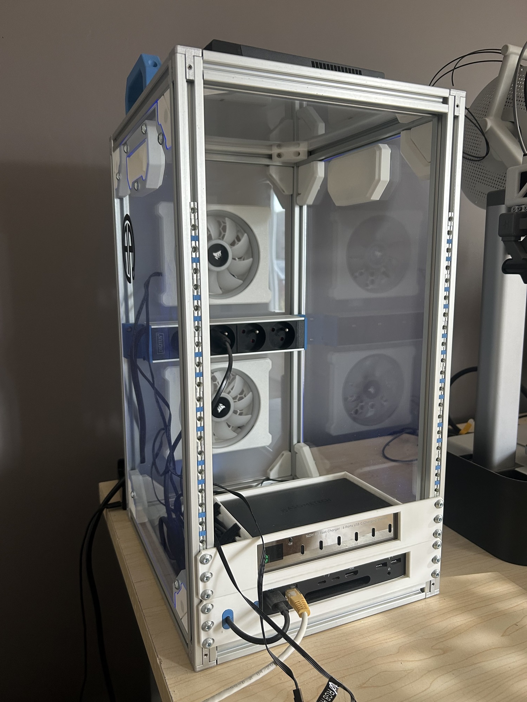

# rack-10inch



A DIY 10-inch rack for homelab gear, inspired by [Jeff Geerling](https://www.youtube.com/@JeffGeerling)'s mini rack videos.

The frame is made of 20x20 aluminium extrusion. It is closed with laser-cut panels (rear, sides and bottom) and held together by 3D printed parts: corner supports, side corner connectors, side handles and fan supports. The rear panel holds the cooling fans, and a support inside the rack holds a power strip.

## Repository structure

| Folder      | Contents                                                     |
| ----------- | ------------------------------------------------------------ |
| `mcad/`     | Mechanical design (FreeCAD) and exports: STEP, STL, DXF, 3MF |
| `ecad/`     | Electronic design                                            |
| `doc/`      | Documentation and images                                     |
| `extra/`    | Miscellaneous files                                          |

## Commit convention

Commit messages follow:

```
type(scope): description
```

### Type

- `feat`: new feature, new part or new export
- `fix`: bug or geometry fix
- `docs`: documentation only
- `style`: formatting, indentation, renaming, with no impact on logic or geometry
- `refactor`: restructuring code, schematic or FreeCAD tree without adding or fixing functionality
- `perf`: performance improvements
- `test`: adding or updating tests
- `build`: build system or dependency changes (`platformio.ini`, libraries)
- `ci`: continuous integration changes (workflows, actions)
- `chore`: other changes that do not modify the product itself

### Scope

- `ecad`: schematic, PCB, electronic components
- `mcad`: 3D modelling, mechanics, exports (STEP, STL, DXF, 3MF)
- `fw`: embedded firmware
- `doc`: user or developer documentation
- `repo`: repository structure, scripts, configuration

### Description

Short and imperative: "add status LED" rather than "added status LED". Descriptions are written in English.

### Examples

```
feat(mcad): add side handle stl export
fix(mcad): adjust corner support clearance
refactor(mcad): reorganize side panel bodies in the tree
feat(fw): update demo code
build(fw): add FastLED dependency
chore(repo): ignore freecad backup files
docs(repo): add commit convention to the README
```
